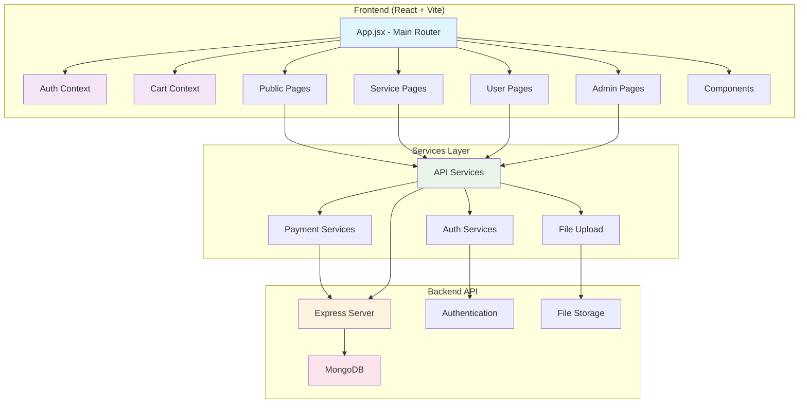
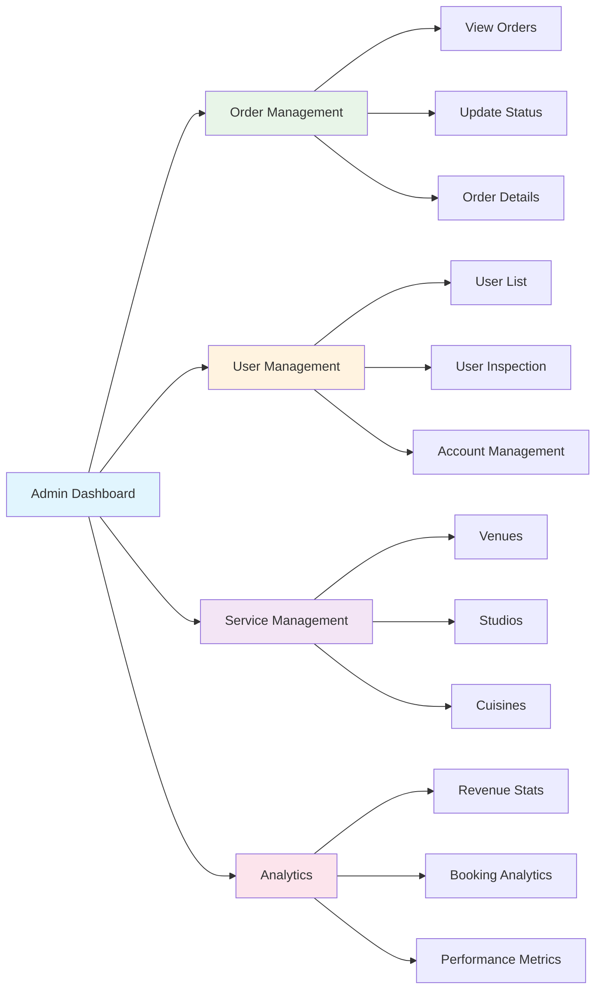

# 🎉 PlanIt Nepal - Event Planning Platform

> A comprehensive event planning platform built with React that connects users with venues, studios, and catering services across Nepal.

[](https://reactjs.org/)
[](https://vitejs.dev/)
[](https://tailwindcss.com/)
[](https://www.framer.com/motion/)

## 📋 Table of Contents

- [Overview](#overview)
- [Features](#features)
- [Architecture](#architecture)
- [Tech Stack](#tech-stack)
- [Project Structure](#project-structure)
- [Installation](#installation)
- [Usage](#usage)
- [Contributing](#contributing)
- [License](#license)

## 🌟 Overview

PlanIt Nepal is a modern, full-featured event planning platform that simplifies organizing events in Nepal. The platform connects users with venues, photography studios, and catering providers, making it easy to plan any event—from birthdays, seminars, parties to corporate gatherings.

### Key Highlights

- 🏛️ **Venue Booking** - Browse and book event venues with availability tracking
- 📸 **Studio Services** - Find professional photography studios with portfolio galleries
- 🍽️ **Catering Services** - Diverse cuisine options with customizable menus
- 🛒 **Shopping Cart** - Seamless booking experience with date management
- 💳 **Payment Integration** - Secure payment processing
- 👨‍💼 **Admin Dashboard** - Comprehensive management tools
- 📱 **Responsive Design** - Mobile-first approach with beautiful animations

## ✨ Features

### For Users
- **Service Discovery**: Browse venues, studios, and cuisines with advanced filtering
- **Interactive Galleries**: Professional photo galleries with lightbox viewing
- **Date Selection**: Real-time availability checking and booking
- **Cart Management**: Add multiple services with different booking dates
- **User Profiles**: Manage bookings and personal information
- **Payment Processing**: Secure checkout with multiple payment options

### For Administrators
- **Dashboard Analytics**: Order statistics and business insights
- **Content Management**: Add, edit, and delete services
- **Order Management**: Track and update booking statuses
- **User Management**: Account oversight
- **Review System**: Customer feedback management

## 🏗️ Architecture



## 🛠️ Tech Stack

### Frontend
- **React 18.3.1** - Modern React with hooks and context
- **Vite 5.4.1** - Fast build tool and development server
- **React Router 6.26.2** - Client-side routing
- **TailwindCSS 4.1.11** - Utility-first CSS framework
- **Framer Motion 12.18.1** - Advanced animations and transitions
- **Lucide React** - Beautiful SVG icons
- **React Toastify** - Toast notifications
- **Axios** - HTTP client for API calls
- **JWT Decode** - JSON Web Token handling

### Development Tools
- **ESLint** - Code linting and formatting
- **Vite Plugins** - React SWC and TailwindCSS integration

## 📁 Project Structure

```
src/
├── components/
│   ├── common/
│   │   ├── AdminHeader.jsx       # Admin navigation header
│   │   └── Header.jsx            # Public site header
│   ├── forms/
│   │   ├── AddCuisineForm.jsx    # Add cuisine form
│   │   ├── AddStudioForm.jsx     # Add studio form
│   │   ├── AddVenueForm.jsx      # Add venue form
│   │   ├── ContactForm.jsx       # Contact form
│   │   └── Edit*.jsx             # Edit forms for services
│   └── ui/
│       └── DateRangePicker.jsx   # Custom date picker component
├── context/
│   ├── AuthContext.jsx           # Authentication state management
│   └── CartContext.jsx           # Shopping cart state management
├── pages/
│   ├── admin/
│   │   ├── AdminDashboard.jsx    # Main admin dashboard
│   │   ├── AdminLogin.jsx        # Admin authentication
│   │   ├── OrderManagement.jsx   # Order tracking and management
│   │   ├── OrderDetails.jsx      # Detailed order view
│   │   ├── UserManagement.jsx    # User account management
│   │   ├── VenueManagement.jsx   # Venue CRUD operations
│   │   ├── StudioManagement.jsx  # Studio CRUD operations
│   │   └── CuisineManagement.jsx # Cuisine CRUD operations
│   ├── auth/
│   │   ├── Login.jsx             # User login
│   │   ├── Register.jsx          # User registration
│   │   ├── ForgotPassword.jsx    # Password recovery
│   │   └── ResetPassword.jsx     # Password reset
│   ├── public/
│   │   ├── Home.jsx              # Landing page
│   │   ├── Contact.jsx           # Contact information
│   │   └── NotFound.jsx          # 404 error page
│   ├── services/
│   │   ├── Venues.jsx            # Venue browsing and filtering
│   │   ├── VenueDetails.jsx      # Individual venue details
│   │   ├── Studios.jsx           # Studio browsing and filtering
│   │   ├── StudioDetails.jsx     # Individual studio details
│   │   └── Cuisines.jsx          # Cuisine browsing and selection
│   └── user/
│       ├── Cart.jsx              # Shopping cart management
│       ├── Profile.jsx           # User profile management
│       ├── PaymentSelection.jsx  # Payment method selection
│       └── OrderSuccess.jsx      # Order confirmation
└── services/
    ├── api.js                    # Base API configuration
    ├── auth.js                   # Authentication services
    ├── venues.js                 # Venue API calls
    ├── studios.js                # Studio API calls
    ├── cuisines.js               # Cuisine API calls
    ├── orders.js                 # Order management API
    ├── payments.js               # Payment processing API
    ├── users.js                  # User management API
    └── reviews.js                # Review system API
```

## 🚀 Installation

### Prerequisites
- Node.js 18+ 
- npm or yarn
- Git

### Setup Steps

1. **Clone the repository**
   ```bash
   git clone https://github.com/rishavadhikari4/planIt_Nepal.git
   cd PlanIt-Nepal-Frontend
   ```

2. **Install dependencies**
   ```bash
   npm install
   ```

3. **Environment Configuration**
   Create a `.env` file in the root directory:
   ```env
   VITE_API_BASE_URL=http://localhost:5000
   VITE_APP_NAME=PlanIt Nepal
   ```

4. **Start development server**
   ```bash
   npm run dev
   ```

5. **Build for production**
   ```bash
   npm run build
   ```

## 🎯 Usage

### Development
```bash
# Start development server with hot reload
npm run dev

# Build for development
npm run build:dev

# Preview production build
npm run preview

# Lint code
npm run lint
```

### Key Features Usage

#### 🏛️ Venue Booking
- Browse venues with advanced filtering (location, capacity, price)
- View detailed venue information with photo galleries
- Check real-time availability and select booking dates
- Add venues to cart with specific date ranges

#### 📸 Studio Services
- Explore photography studios with portfolio galleries
- Professional lightbox gallery with masonry and grid layouts
- Book studio sessions with date selection
- View services and pricing information

#### 🍽️ Cuisine Selection
- Browse cuisine categories and individual dishes
- Add multiple dishes to cart with quantity management
- Flexible dish selection with real-time cart updates

#### 🛒 Cart Management
- Multi-service cart with different item types
- Date-specific bookings for venues and studios
- Quantity management for cuisine items
- Seamless checkout process

## 🎨 UI/UX Features

### Animations & Interactions
- **Framer Motion** powered animations throughout the application
- Smooth page transitions and component loading states
- Interactive hover effects and micro-interactions
- Mobile-responsive gesture support

### Design System
- **Gradient Themes**: Purple to pink gradients for primary actions
- **Glass Morphism**: Backdrop blur effects for modern aesthetics
- **Responsive Design**: Mobile-first approach with breakpoint optimization
- **Accessibility**: WCAG compliant with proper contrast ratios

## 🔒 Authentication & Authorization

### User Roles
- **Users**: Browse services, make bookings, manage profiles
- **Administrators**: Full platform management capabilities

### Security Features
- JWT-based authentication
- Protected routes with role-based access
- Secure session management
- Password encryption and recovery

## 📊 Admin Dashboard Features



## 🤝 Contributing

1. **Fork the repository**
2. **Create a feature branch**
   ```bash
   git checkout -b feature/amazing-feature
   ```
3. **Commit your changes**
   ```bash
   git commit -m 'Add amazing feature'
   ```
4. **Push to the branch**
   ```bash
   git push origin feature/amazing-feature
   ```
5. **Open a Pull Request**

### Development Guidelines
- Follow React best practices and hooks patterns
- Use TypeScript for new components when possible
- Maintain responsive design principles
- Write meaningful commit messages
- Test across different screen sizes

## 📝 License

This project is licensed under the MIT License - see the [LICENSE](LICENSE) file for details.

## 👥 Team

- **Rishav Adhikari** - [@rishavadhikari4](https://github.com/rishavadhikari4)

## 🙏 Acknowledgments

- React and Vite communities for excellent documentation
- TailwindCSS for the utility-first approach
- Framer Motion for smooth animations
- Lucide React for beautiful icons
- The open-source community for inspiration and tools

---

<div align="center">
  <p>Made with ❤️ for anyone planning their perfect event in Nepal</p>
  <p>
    <a href="#top">Back to Top ⬆️</a>
  </p>
</div>
